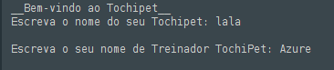
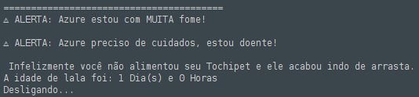

<!-- Banner -->

  

---
## 📖 Descrição
Este projeto consiste em desenvolver um **bichinho virtual (inspirado no Tamagotchi dos anos 90)** como parte da disciplina **Conceitos de Algoritmos** no curso de **Tecnologia em Análise e Desenvolvimento de Sistemas**.

O objetivo é criar um **algoritmo funcional** que simula as necessidades de um pet virtual, incluindo fome, felicidade, limpeza e saúde. O usuário deve interagir com o bichinho através de um **menu interativo**.

---

<h1 align="center"> 🐾 Bem-vindo ao Tochipet!🐾 </h1>

  
  
  

---
No coração digital criado pela Tocatoon Creators, nasce o Tochipet – um bichinho virtual que vive dentro da sua tela, mas que depende de você para crescer, sorrir e se manter saudável.

Inspirado nas febres virtuais dos anos 90, mas com uma identidade única, o Tochipet combina nostalgia com inovação. Seu desafio é simples, mas cheio de emoção: cuidar do seu companheiro pixelado e garantir que ele viva feliz até o último dia.

Seja cuidadoso… ou seu Tochipet poderá partir antes da hora.
Mas se for atencioso, verá seu amigo pixelado viver uma vida plena, cheia de sorrisos e aventuras virtuais.

✨ Tochipet não é apenas um jogo. É um elo entre você e uma criaturinha digital que precisa de atenção, afeto e responsabilidade.
---

📜 A Lenda do Tochipet

Muito tempo atrás, quando os primeiros mundos digitais começaram a ganhar forma, pequenos fragmentos de código começaram a pulsar como se fossem corações. Esses fragmentos, nascidos da fusão entre emoção humana e energia dos pixels, deram origem às primeiras criaturinhas digitais: os Tochipets.

Criados para serem companheiros, eles não vivem sozinhos — precisam de cuidadores humanos para existir plenamente. Cada Tochipet nasce como uma centelha de energia pixelada, mas sua forma e comportamento são moldados pelo carinho, atenção e escolhas de quem o adota.

Quando bem cuidados, os Tochipets brilham com cores vibrantes, vivem felizes e chegam até o último dia de sua vida digital como verdadeiros campeões.

Mas quando esquecidos, a tristeza, a sujeira ou a fome consomem sua essência até que desapareçam no fluxo de dados, voltando ao “nada” de onde vieram.

Segundo os Arquivos da Tocatoon, apenas os melhores cuidadores são capazes de guiar seus Tochipets até o final de seus 7 dias de vida. Aqueles que conseguem são lembrados como Mestres Tocatoon, guardiões dos corações pixelados.

E assim, a cada nova geração, os Tochipets renascem — esperando um novo humano disposto a lhes dar amor, cuidado e propósito.

✨ O seu Tochipet já está pronto. Ele precisa de você.
A pergunta é: você está pronto para cuidar dele?

---

## 🧩 Funcionalidades
- ⏳ **Avançar o tempo** → Simula 8 horas na vida do pet.  
- 🍽️ **Alimentar** → Diminui a fome, mas alimentar sem necessidade reduz felicidade.  
- 🎮 **Jogar (pedra, papel e tesoura)** → Aumenta felicidade.  
- 🚿 **Dar banho** → Restaura limpeza, mas insistir sem necessidade deixa o pet triste.  
- 📊 **Ver status** → Mostra todos os atributos do pet (idade, fome, limpeza, felicidade, saúde).  
- ❌ **Desligar** → Encerra o programa.  

---

## 📊 Atributos do Pet
- 🍼 **Idade:** de 0 a 7 dias (máximo de vida).  
- 😀 **Felicidade:** 0 a 10 pontos (se chegar a 0 → morte por tristeza).  
- 🧼 **Limpeza:** começa em 10 (se chegar a 0 → morte por sujeira).  
- 🍔 **Fome:** começa em 0 (se chegar ao máximo → morte por fome).  
- 🤒 **Doença:** pode ficar doente de forma aleatória, com chances de cura após 8h, 16h ou 24h.  

---

## 🎥 Demonstração

  
  
  

---

## 📦 Como executar
---
🐾 Tochipet

Seu pet virtual em Portugol!

🚀 Como começar

Baixe o projeto
Clique no arquivo PROJETO TOCHIPET.por
 e faça o download.

Abra no Portugol
Você pode usar:

💻 Portugol Studio

🌐 Portugol WebStudio

Execute e divirta-se!

No Portugol Studio: abra o arquivo e clique em Executar.

No WebStudio: importe o arquivo e clique em Run.

🎮 Interaja com seu pet

Alimente, brinque e cuide do seu Tochipet para mantê-lo feliz e saudável!
---
👥 Equipe de Desenvolvimento

👩‍💻 Nome 

👨‍💻 Nome 

👩‍💻 Nome : Vinicius de Araujo dos Anjos

📜 Licença

Projeto desenvolvido exclusivamente para fins acadêmicos.

